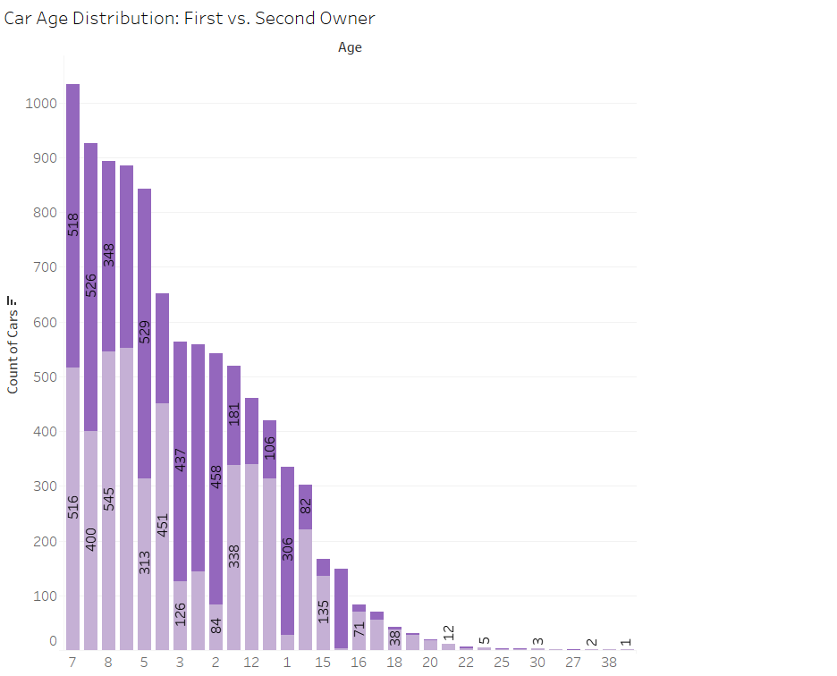
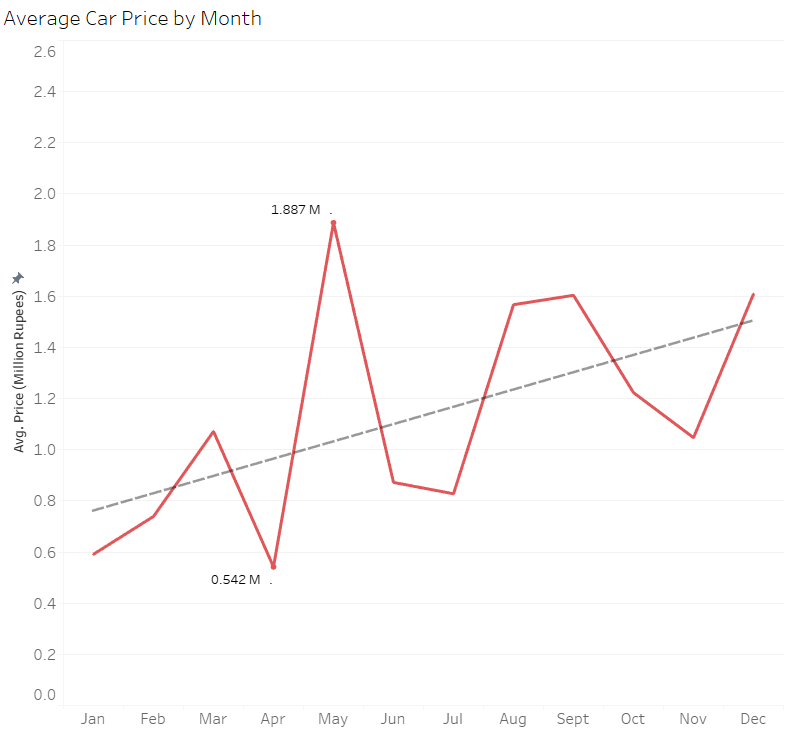
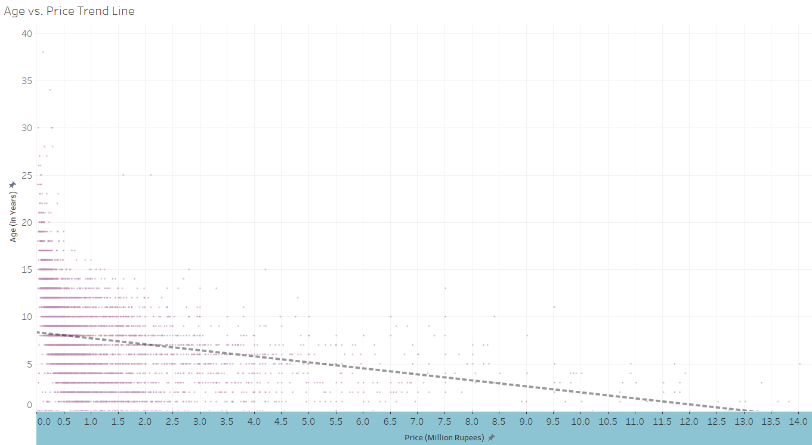
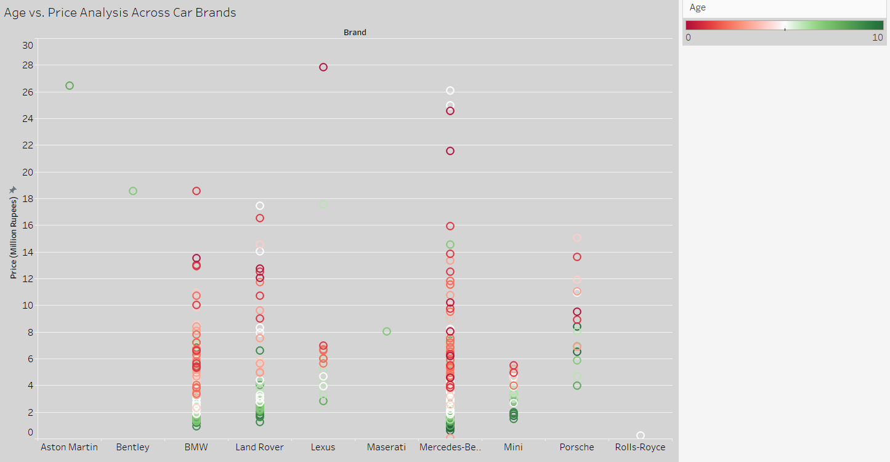
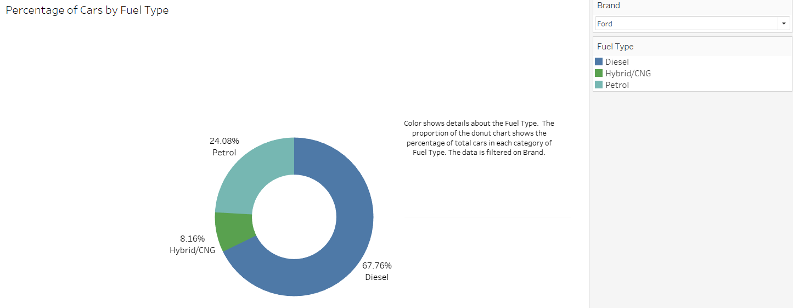
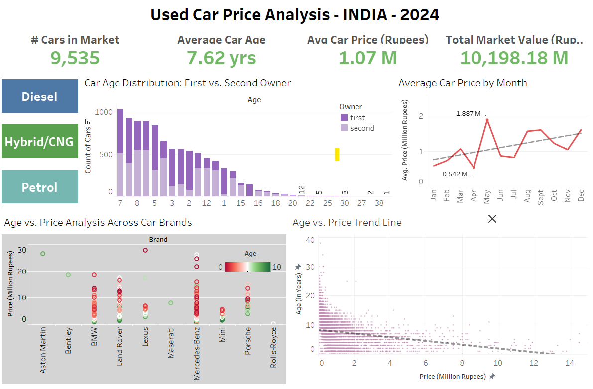

# Used_car_prices_Analysis_india_2024

## About the Project

This project focuses on analyzing the latest dataset from the Used Car Market in India to uncover key trends in car pricing based on various factors such as brand, age, ownership, kilometers
driven, fuel type, transmission type, and more. Using Tableau as the primary analytical tool, we developed insightful visualizations, including bar graphs, line graphs, scatter plots, and donut
charts, to present the findings in a clear and self-explanatory manner.

The process involved hands-on experience in the end-to-end data analytics workflow, starting with dataset selection, data cleaning, and feature extraction to transform the raw data into
meaningful insights. A major focus was on choosing the most effective visualization techniques to enhance data understanding and storytelling.

This project not only deepened my proficiency in Tableau but also strengthened my skills in data transformation and analytical decision-making. It was a valuable learning experience that
highlighted the importance of visual storytelling in data analysis.

## Introduction

The Indian used car market was valued at USD 5,621.4 million in 2023 and is projected to grow at a Compound Annual Growth Rate (CAGR) of 12.1% between 2024 and 2030, reaching USD
12,417.6 million by 2030. This growth is driven by rising internet penetration, which makes used car information easily accessible, and increasing demand for off-lease vehicles, car subscriptions,
and reliable second-hand cars. Additionally, the depreciation of luxury vehicles boosts the market as lower resale values encourage quicker sales, reducing car ownership durations and
increasing demand. Over the past decade, the average ownership period of cars has nearly halved, providing newer and better-maintained vehicles in the used car market. Combined with
the favorable buy-to-resale cost ratio and a steady supply of quality cars, consumers increasingly opt for used vehicles over new ones. These factors collectively support the strong expansion of
India’s used car market.

## Dataset & Cleaning

SOURCE - https://www.kaggle.com/datasets/mohitkumar282/used-car-dataset/data

This dataset contains information about used cars in the Indian market, comprising 9,582 entries with 11 detailed attributes. The data appears to be collected in 2024, providing a comprehensive
view of the second-hand car market in India.

Dataset Features

Brand: Car manufacturer (e.g., Volkswagen, Maruti Suzuki, Honda, Tata)
Model: Specific car model (e.g., Taigun, Baleno, Polo, WRV)
Year: Manufacturing year of the vehicle (ranging from older models to 2024)
Age: Age of the vehicle in years
kmDriven: Total kilometers driven by the vehicle
Transmission: Type of transmission (Manual or Automatic)
Owner: Ownership status (first or second owner)
FuelType: Type of fuel (Petrol, Diesel, Hybrid/CNG)
PostedDate: When the car listing was posted
AdditionalInfo: Extra details about the vehicle
AskPrice: Listed price in Indian Rupees

Data Cleaning

* The column 'kmDriven' is in units km. Each entry had the string ‘km’ at the end of the
values. The unnecessary string was removed.
* Converted 'kmDriven' into miles and renamed the column to ‘distDriven (miles)’.
* The 'distDriven (miles)' column had 47 missing (blank) values. These will need to be
handled to avoid issues in further calculations. Removed blank/null values from the
‘distDriven (miles)’ column.
* No other columns have null values, ensuring data integrity for those fields.
* Column ‘AskPrice’ had special characters (₹ ) in front of each price. Cleaned data by
removing the ‘₹’ from each price.
* Column ‘AskPrice’unit is converted to Million Rupees by dividing by 1,000,000.

## Tableau Visualization

I utilized Tableau to create a visual representation of the data. 

### Snapshots

A bar graph is shown with the count of the number of used cars with each bar representing the car’s age in years. The bars have been arranged in descending order of
number of cars. Each bar is further coloured to detail the car’s ownership.

Observations:
* The majority of cars are not older than 10 years.
* The largest subset of cars is around 7 years old.
* The overall average age of cars in the dataset is 7.6 years, indicating that most car owners sell their cars after using them for approximately 7 years.
* Cars sold within 2-3 years of age are predominantly first-owner cars.
* As the car age progresses to 5-9 years, a significant number of second-resale cars become available in the market.

A line graph and corresponding trend line are shown to track the average price fluctuations over the range of months in 2024 in which the used cars were listed in the market.

Observations:
* The trend line shows an upward trend, indicating a growing interest in high-end used cars in the Indian market.
* Occasional fluctuations are observed, suggesting unpredictable seasonality in the market.

Age in years on the Y axis and Price in millions on the X axis result in a scatterplot-like visual where the intensity of colour in a region would mean the concentration of
maximum data points. A trend line is also given to highlight the falling trajectory.

Observations:
* The overall trend line shows an inverse relationship between the age of a car and its price.
* Unlike antique items like jewelry or furniture, whose value increases with age if well-maintained, the resale value of cars depreciates as they get older.
* The scatter plot shows a concentration of points for cars aged less than 5 years, with average resale prices around 1-2 million rupees.
* A few outliers exist, highlighting that luxury cars retain significant value due to their brand appeal, regardless of age.

A vertical scatter plot in bars represents the top 10 costly brands in a range of ages up to 10 years, represented in varying shades of green and red (legend given). Since white is
also a colour in the scheme chosen, the background colour was made grey for better legibility.

Observations:
* The concentration of red shades indicates that most cars sold are within 5 years of age.
* The green shades are predominantly located in the lower part of the graph, further demonstrating the negative relationship between age and price.
* Green spots in the top part of the graph highlight outliers, representing luxury brands that retain higher value despite their age.

Donut chart created with colour differentiation for the different types of fuels used namely Diesel, Petrol and Hybrid/ CNG. The proportion of the donut chart shows the percentage 
of total cars in each category of the fuel type. The data is filtered on the basis of Brand. In the above visualization, it is showing the proportions for a particular brand, Ford.

Observations:
* For most of the brands, Diesel cars dominate the Indian market, followed by petrol cars.
* This is because diesel offers better mileage than petrol, making it ideal for heavy use over long distances.
* CNG is emerging as a newer, cleaner alternative and is slowly gaining traction among users.

The visualizations have been neatly integrated into an interactive dashboard that allows users to filter by Fuel Type by toggling the keys at the top left, providing a more granular
and focused view of the data. At the top of the dashboard, Key Performance Indicators (KPIs) are prominently displayed, offering an overview of critical metrics such as the
total number of cars listed, average age, average price, and total market value. This interactive design enhances user experience and makes data exploration seamless and insightful.

## Conclusion

The Indian used car market is experiencing significant growth, with over 9,500 vehicles listed for sale and a total market value of approximately ₹10,191.50M. The analysis reveals that, despite
an average car age of 7.6 years, demand for used cars remains strong, driven by value, reliability, and affordability.

Key insights indicate that:
* Luxury cars retain higher resale value due to their brand appeal and slower depreciation.
* Older, non-luxury cars provide affordable options, offering good bargains for budget-conscious buyers.
* Diesel vehicles dominate the market due to their higher mileage efficiency, while Hybrid/CNG options are steadily gaining traction as a cleaner, sustainable alternative.

Overall, the used car market is thriving, fueled by evolving consumer preferences, increased availability of quality vehicles, easy market accessibility due to the internet, and customer’s
growing confidence in second-hand purchases. This upward trend highlights both aspirations and opportunities in the Indian automotive landscape, pointing toward continued expansion and
innovation in the years to come.

## How to Use

To view the visualization, follow these steps:
1. Download the Tableau workbook from the repository.
2. Open Tableau Desktop or Tableau Public.
3. Open the downloaded workbook to interact with the visualization.
